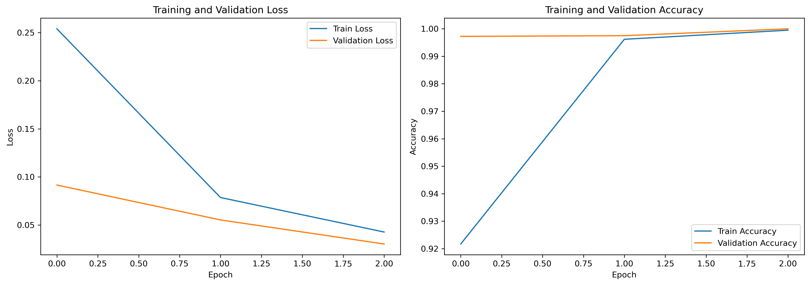

# ML4DQM HCAL Run Classification: Full Documentation

## 1. Introduction

### Project Goal
To develop and evaluate Vision Transformer (ViT) based models for classifying Large Hadron Collider (LHC) Hadronic Calorimeter (HCAL) DigiOccupancy data into one of two source runs (Run 355456 or Run 357479).

### Task Summary
-   **Input:** 2D detector hit maps (DigiOccupancy).
-   **Output:** Binary classification (Run 1 or Run 2).
-   **Models:** Standard Vision Transformer (ViT), Mixture-of-Experts ViT (MoE-ViT).
-   **Evaluation:** Accuracy, ROC Curve, AUC.

## 2. Data Exploration (EDA)

### Dataset Description
Two datasets representing HCAL DigiOccupancy (hit counts).

| Parameter             | Value             | Description                     |
| :-------------------- | :---------------- | :------------------------------ |
| Dataset 1             | `Run355456`       | Source Run                      |
| Dataset 2             | `Run357479`       | Source Run                      |
| Shape per Dataset     | `(10000, 64, 72)` | (Samples, iEta, iPhi)           |
| Value Range (Run 1)   | 0.0 - ~1565       | Hit Multiplicity                |
| Value Range (Run 2)   | 0.0 - ~1092       | Hit Multiplicity                |
| Sparsity (% Zeros)    | ~79.77%           | Percentage of zero-value cells |

### HCAL Coordinate System
-   **iEta:** Pseudorapidity (related to polar angle, along beam axis). 64 bins.
-   **iPhi:** Azimuthal angle (around beam axis). 72 bins.
-   

> **Description for Diagram:** A simple rectangle representing the unrolled detector plane. Label the Y-axis as 'iEta (0-63)' and the X-axis as 'iPhi (0-71)'. Indicate the approximate location of the active bands seen in the data (e.g., shaded horizontal bars near top and bottom).

### Basic Statistics

| Statistic          | Run 355456 | Run 357479 | Notes                             |
| :----------------- | :--------- | :--------- | :-------------------------------- |
| Min Value          | 0.0        | 0.0        | Minimum hits                      |
| Max Value          | ~1565      | ~1092      | Maximum hits (differs per run)    |
| Mean Value         | ~157.14    | ~181.08    | Avg hits (Run 2 is higher)        |
| Median Value       | 0.0        | 0.0        | Due to high sparsity            |
| Std Deviation      | ~364.31    | ~362.53    | Similar spread                    |
| Zero % (Overall)   | 79.77%     | 79.77%     | Identical sparsity structure      |
| Avg Sparsity/Image | 79.77%     | 79.77%     | Consistent sparsity per sample    |

### Key Visualizations & Observations

**Average Occupancy:** Shows typical detector activity patterns.


> **Caption:** Average DigiOccupancy (log scale). Activity is concentrated in two bands (iEta ~0-12 and ~50-60). Run 357479 shows higher average intensity (more yellow/green).

**Difference Map:** Highlights regions distinguishing the runs.


> **Caption:** Difference (Run 357479 - Run 355456). Systematic intensity differences exist within the active bands. Red = higher in Run 2, Blue = higher in Run 1.

**Sample Images:** Shows individual sample characteristics.


> **Caption:** Random samples confirm the band structure and sparsity in individual luminosity sections. Intensity varies per sample.

**Sparsity Patterns:** Shows where hits *ever* occur.


> **Caption:** Frequency of non-zero hits. Left/Middle: Active regions are nearly identical for both runs. Right: Minimal difference in *where* hits occur, confirming intensity is the key differentiator.

**Value Distribution:** Shows the frequency of different hit counts (non-zero only).


> **Caption:** Distribution of non-zero DigiOccupancy values (log density scale). Both runs show similar distributions, though subtle differences exist.

### EDA Conclusions
-   Data is highly structured and sparse.
-   Active regions are consistent across runs.
-   Key difference lies in hit *intensity* within active bands.
-   Normalization is crucial due to wide value range.
-   Symmetry exists between top/bottom bands.
-   Standard image augmentations (rotations, flips) are likely unsuitable.

## 3. Data Preprocessing

A simple workflow prepares the data for the models.


> **Description for Diagram:** Boxes: [Load Run1 Data] & [Load Run2 Data] -> [Assign Labels (0, 1)] -> [Combine Data & Labels] -> [Apply `log1p` Normalization] -> [Reshape to (N, 1, H, W)] -> [Split (Train/Val)] -> [Create DataLoaders].

**Steps:**
1.  **Load:** Load `.npy` files.
2.  **Label:** Assign 0 to Run 355456, 1 to Run 357479.
3.  **Combine:** Stack data and labels.
4.  **Normalize:** Applied `np.log1p(X)` (log(1+X)) to handle large values and skewness, while keeping zeros as zero.
5.  **Reshape:** Added channel dimension: `(N, 64, 72)` -> `(N, 1, 64, 72)`.
6.  **Split:** Divided into Training (80%) and Validation (20%) sets.
7.  **DataLoaders:** Created PyTorch DataLoaders for batching.

**Data Split:**

| Set         | Percentage | # Samples |
| :---------- | :--------- | :-------- |
| Training    | 80%        | 16000     |
| Validation  | 20%        | 4000      |
| **Total**   | **100%**   | **20000** |

## 4. Model Architecture

### Standard Vision Transformer (ViT)


> **Description for Diagram:** Show: Input Image -> Grid of Patches -> Linear Projection (Patch Embedding) -> Add Positional Embeddings -> Prepend CLS Token -> Sequence of Transformer Blocks [LayerNorm -> Multi-Head Self-Attention (MSA) -> Add & Norm -> MLP -> Add & Norm] -> Select CLS Token -> LayerNorm -> Linear Head -> Output Logits.

**Key Components:**
-   **Patch Embedding:** Divides image into patches, linearly embeds them.
-   **Positional Embedding:** Adds location information to patch embeddings.
-   **CLS Token:** A learnable token aggregated for final classification.
-   **Transformer Block:** Core unit with Multi-Head Self-Attention (MSA) and MLP layers.
-   **MSA:** Allows tokens (patches) to attend to each other, capturing global relationships.
-   **MLP:** Feed-forward network applied independently to each token.

**Hyperparameters (Standard ViT):**

| Parameter     | Value         | Description                             |
| :------------ | :------------ | :-------------------------------------- |
| `img_size`    | `(64, 72)`    | Input image dimensions                  |
| `patch_size`  | `32` (8*4)    | Size of patches (Note: Large, non-square) |
| `in_channels` | `1`           | Grayscale input                         |
| `num_classes` | `2`           | Binary classification (Run1/Run2)       |
| `embed_dim`   | `64`          | Dimension of embeddings                 |
| `depth`       | `4`           | Number of Transformer blocks            |
| `num_heads`   | `2`           | Number of attention heads               |
| `mlp_ratio`   | `4.0`         | Ratio for MLP hidden dimension          |
| `drop_rate`   | `0.1`         | Dropout rate for MLP/Embeddings         |
| `attn_drop_rate`| `0.0`         | Dropout rate for attention weights      |

### Mixture-of-Experts ViT (MoE-ViT)


> **Description for Diagram:** Show one MoE Transformer Block. Input -> LayerNorm -> MSA -> Add & Norm -> LayerNorm -> **Router Network** -> (Split) -> [**Expert MLP 1**], [**Expert MLP 2**], ... -> (Combine based on Router weights) -> Add & Norm -> Output. Highlight the Router and multiple Expert MLPs replacing the single MLP of the standard block.

**Key Difference:**
-   **MoE Block:** Replaces the standard MLP in each Transformer block with multiple 'expert' MLPs.
-   **Router Network:** A small network that learns to assign each token (patch) to one or more experts dynamically based on the input. Allows for specialization.

**Hyperparameters (MoE-ViT):**

| Parameter     | Value         | Description                             |
| :------------ | :------------ | :-------------------------------------- |
| `img_size`    | `(64, 72)`    | Input image dimensions                  |
| `patch_size`  | `32` (8*4)    | Size of patches                         |
| `in_channels` | `1`           | Grayscale input                         |
| `num_classes` | `2`           | Binary classification (Run1/Run2)       |
| `embed_dim`   | `32` (256//8) | Dimension of embeddings                 |
| `depth`       | `4` (8//2)    | Number of MoE Transformer blocks        |
| `num_heads`   | `2` (8//4)    | Number of attention heads               |
| `num_experts` | `2`           | Number of expert MLPs per block         |
| `mlp_ratio`   | `4.0`         | Ratio for MLP hidden dimension (per expert) |
| `drop_rate`   | `0.1`         | Dropout rate                            |
| `attn_drop_rate`| `0.0`         | Dropout rate for attention weights      |

*(Note: MoE-ViT uses smaller `embed_dim`, `depth`, `num_heads` as per the provided code)*

## 5. Training Process


> **Description for Diagram:** Start -> Loop Epochs -> Set model.train() -> Loop Batches in Train Loader -> [Load Batch -> To Device -> Optimizer Zero_grad -> Forward Pass -> Calculate Loss -> Backward Pass -> Optimizer Step -> Accumulate Loss/Metrics] -> End Batch Loop -> Set model.eval() -> Loop Batches in Val Loader -> [Load Batch -> To Device -> No Grad -> Forward Pass -> Calculate Loss -> Accumulate Loss/Metrics] -> End Batch Loop -> Calculate Epoch Metrics -> Scheduler Step -> Check for Best Model -> Save Model -> End Epoch Loop -> Finish.

**Setup:**
-   **Device:** CUDA (GPU) if available, otherwise CPU.
-   **Loss Function:** `nn.CrossEntropyLoss` (Combines LogSoftmax and NLLLoss).
-   **Optimizer:** `AdamW` (Adam with weight decay).
-   **Learning Rate Scheduler:** `ReduceLROnPlateau` (Reduces LR if validation loss stagnates).
-   **Epochs:** 3 (as per code execution).

**Training Curves:**


> **Caption:** Standard ViT Training: Loss decreases and accuracy increases rapidly, converging quickly on the validation set.


> **Caption:** Standard ViT vs MoE-ViT Training: Standard ViT converges faster and achieves higher validation accuracy within 3 epochs. MoE-ViT starts slower but improves significantly, reaching near-perfect accuracy. MoE-ViT loss curve is less smooth initially.

## 6. Evaluation & Results

Models were evaluated on the **Validation Set** (20% of data).

### Standard ViT Results

**Performance:**

| Metric   | Value  |
| :------- | :----- |
| Accuracy | 1.0000 |
| AUC      | 1.0000 |

**Visuals:**


> **Caption:** Standard ViT Confusion Matrix: Perfect classification on the validation set (4000 samples).


> **Caption:** Standard ViT ROC Curve: Achieves perfect AUC of 1.0, indicating excellent separability.

### MoE-ViT Results

**Performance:**

| Metric   | Value     |
| :------- | :-------- |
| Accuracy | 0.9985    |
| AUC      | 1.0000    |


**Comparison:** The Standard ViT slightly outperformed the MoE-ViT within the limited 3 epochs of training shown, achieving perfect scores faster. The MoE-ViT still reached very high performance.

## 7. Attention Analysis

Visualizing the attention mechanism helps understand what the model focuses on. We look at the attention paid by the final CLS token to the input patches in the last block.

### Standard ViT Attention


> **Caption:** Standard ViT Attention. Left: Input Sample. Middle: CLS token attention heatmap (reshaped patch attention). Right: Overlay. The model generally focuses attention (brighter areas in heatmap/overlay) on the active horizontal bands of the detector. The focus can vary slightly depending on the sample (e.g., Sample 1 vs Sample 2 focus).

### MoE-ViT Attention


> **Caption:** MoE-ViT Attention. Exhibits more structured, quadrant-like attention patterns compared to the standard ViT. The specific quadrants attended to differ significantly between samples (e.g., Sample 1 vs Sample 2), suggesting the router network is directing attention differently based on input, potentially engaging specialized experts for different regions/features.

### MoE Early Stopping Insight
The notebook mentions that if the MoE model is trained for longer, the experts might converge to similar solutions, diminishing the MoE benefit. The observed performance and distinct attention patterns might be characteristic of early-stage MoE training where specialization is more pronounced. Stopping early might be necessary to retain this expert diversity.

## 8. Conclusion

-   Both Standard ViT and MoE-ViT models successfully learned to classify the HCAL DigiOccupancy images based on their source run with very high accuracy on the validation set.
-   The data exploration revealed that intensity differences within consistent active regions are the primary distinguishing features.
-   `log1p` normalization was used for preprocessing.
-   The Standard ViT converged slightly faster and achieved perfect metrics within 3 epochs.
-   MoE-ViT also achieved near-perfect results and demonstrated potentially more specialized attention patterns, hinting at expert division of the task.
-   Attention visualization confirmed that models focus on the physically relevant active detector regions.

## 9. How to Run / Reproduce

1.  **Environment:** Create an environment with Python and install necessary packages:
    ```bash
    pip install numpy torch torchvision scikit-learn matplotlib seaborn tqdm
    ```
2.  **Data:** Download datasets and place them in `./data/`.
3.  **Execution:** Run the provided Jupyter notebooks (`EDA.ipynb`, `Model_Training.ipynb`) sequentially or execute a refactored Python script (`main.py`).
