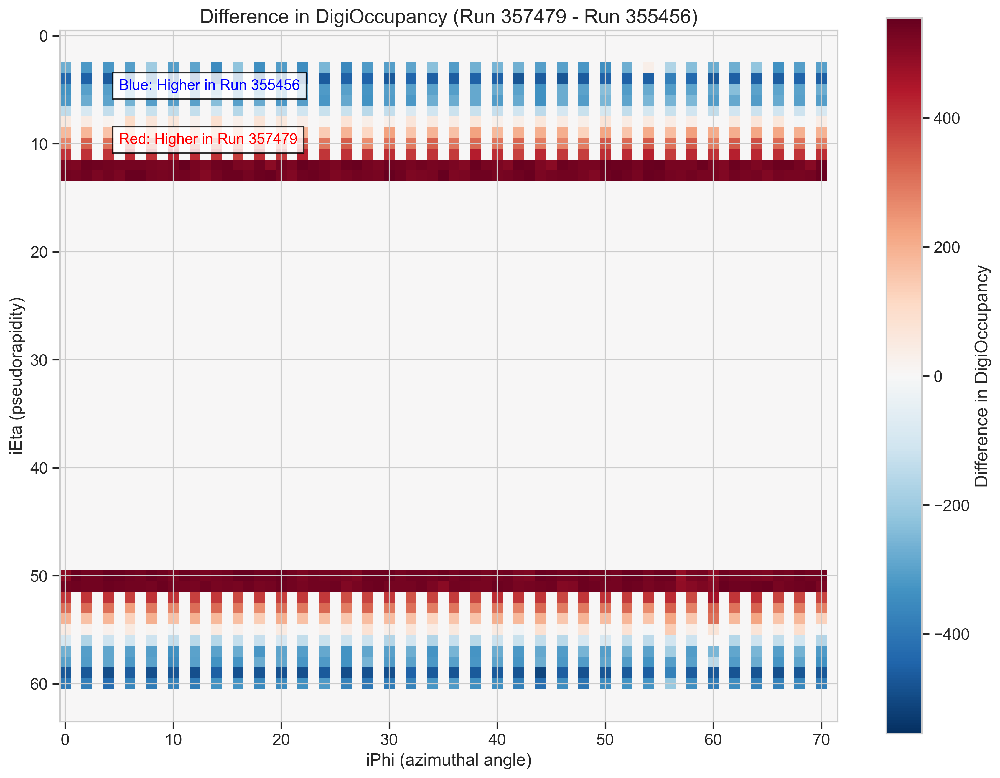

# ML4DQM: Vision Transformer for HCAL Run Classification

This is an evaluation task for GSoC 2025. 

**Goal:** Classify Hadronic Calorimeter (HCAL) DigiOccupancy images into their source LHC runs (Run 355456 vs. Run 357479) using Vision Transformer models.

## Task Overview

We use Vision Transformer (ViT) and Mixture-of-Experts ViT (MoE-ViT) to learn distinguishing features between detector hit patterns from two different runs.

**Input Data:** 2D arrays (64 iEta x 72 iPhi) of hit multiplicities per Luminosity Section.


> **Caption:** Sample DigiOccupancy images from Run 355456 (left) and Run 357479 (right), showing characteristic activity bands.

## Key Distinguishing Features

The primary differences between the runs lie in the intensity patterns within the active detector regions.


> **Caption:** Difference in average DigiOccupancy (Run 357479 - Run 355456). Red indicates higher average hits in Run 357479, Blue in Run 355456.

## Models Used

1.  **Standard Vision Transformer (ViT):** A baseline ViT architecture.
2.  **Mixture-of-Experts Vision Transformer (MoE-ViT):** A ViT using specialized 'expert' networks potentially focusing on different data aspects.


> **Description for Diagram:** Show a standard Transformer block (MSA -> MLP) side-by-side with an MoE block (MSA -> Router -> Multiple MLPs -> Combine). Keep it very high-level.

## Key Results

Both models achieve high classification performance on the validation set.

**Performance Metrics (Validation Set):**

| Model        | Accuracy | AUC    |
| :----------- | :------- | :----- |
| Standard ViT | 1.0000   | 1.0000 |
| MoE-ViT      | 0.9985   | 1.0000 |

**Evaluation Visuals (Standard ViT):**


> **Caption:** Confusion Matrix for the Standard ViT, showing perfect classification on the validation set.


> **Caption:** ROC Curve for the Standard ViT, achieving an AUC of 1.0000.


> **Caption:** ROC Curve for the MoE-ViT, achieving an AUC of 1.0000.

## Attention Mechanism Highlights

The models learn to focus on relevant detector regions. MoE-ViT shows more structured, potentially specialized attention patterns.


> **Caption:** Standard ViT Attention: Focuses broadly on active bands.


> **Caption:** MoE-ViT Attention: Shows more structured, quadrant-like focus, suggesting expert specialization.

## How to Run

1.  **Clone the repository:**
    ```bash
    git clone <your-repo-url>
    cd <your-repo-directory>
    ```
2.  **Set up environment:** (Assuming a `requirements.txt` file)
    ```bash
    pip install -r requirements.txt
    ```
    *Key requirements: `numpy`, `torch`, `torchvision`, `sklearn`, `matplotlib`, `seaborn`, `tqdm`*
3.  **Download Data:** Place `Run355456_Dataset.npy` and `Run357479_Dataset.npy` into a `data/` subdirectory.
4.  **Run Training & Evaluation:** (Assuming notebooks are refactored into a script like `main.py`)
    ```bash
    python main.py
    ```
    *(Alternatively, provide instructions to run the Jupyter notebooks sequentially)*

## Detailed Documentation

For a deeper dive into the data exploration, preprocessing, model architectures, and analysis, see the full documentation:
➡️ **[Full Documentation](Documentation.md)**
